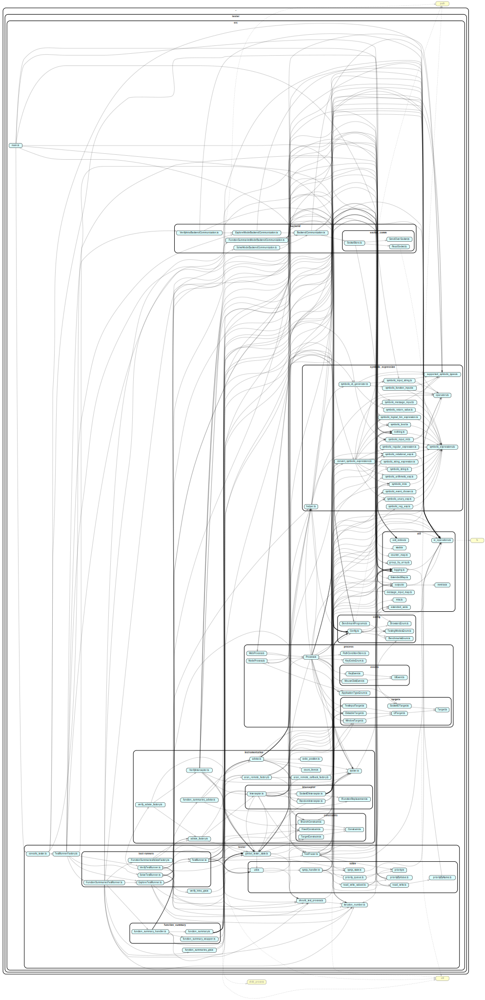

# StackFul
___

## Overview

There are two major components to the StackFul concolic tester:

* JS_Concolic: Runs the frontend code: launching a headless (i.e., GUI-less) browser with the application and performing concolic testing iterations to collect path constraints. When a non-deterministic value is defined (e.g., a call to `Math.random()`), the frontend ensures that the symbolic input parameter corresponding to that value is assigned the value precomputed by the backend (if a value was indeed precomputed for this iteration).
* Concolic_Testing_Backend: Receives concolic test run results (i.e., the path constraint that was collected in the last iteration). It uses these results to construct a symbolic execution tree. Given a particular path in this tree to be followed, the backend computes concrete values for the symbolic input parameters that appear in that path, and communicates these values to the frontend. The execution path to be followed can be specified either by the backend or by the frontend, depending on the exploration mode that is used.

## Exploration modes
The concolic tester supports four modes for exploring an application:

* `explore` mode: The application is explored in a naive, brute-force manner. Specifically, the backend explores the symbolic execution tree of the application via simple breadth-first traversal. The execution paths to be followed in each iteration are just the next unexplored path that was encountered by the backend's breadth-first traversal.
* `solve` mode: The tester uses the SymJS algorithm for exploring the application. This algorithm attempts to construct event sequences that maximise the number of conflicting read/writes on a set of variables shared between the constituent events of the event sequence. The frontend collects all available "SymJS states" in a priority queue, with the priority being the size of the set of conflicting variables. As each SymJS state corresponds with one particular program path, the next execution path to be followed is determined by the frontend, as opposed to the `explore` mode where the path is decided by the backend.
* `function_summaries` mode: The tester generates and uses function-summaries (cfr. "Compositional Dynamic Test Generation" by Patrice Godefroid). Currently under development.
* `verify` mode: The tester operates in two phases: an initial intra-process test phase where it detects errors on the server component, followed by an inter-process phase where the tester attempts to reproduce the previously discovered server errors by reaching these errors from the client. Currently under development.

Note that an exploration mode must be specified, as a command-line argument, for both the frontend and the backend. These modes must be identical. If not, an error is thrown by the backend upon receiving a message from the frontend.

## Individual vs. full-stack
Depending on the exploration mode, the tester can be used either for full-stack testing of a web application (i.e., simultaneously testing the server and the client of the application), or for testing the client and the server individually. 


## Backend usage
The backend can be launched by executing the script `shell.sh` located in the backend directory.
Usage: `sh shell.sh explore|solve|function_summaries|verify [i]`
* `explore` launches the backend in explore mode, `solve` in solve mode, `verify` in verify-intra mode, and  `function_summaries` (or `fs`) for generating function summaries. This argument is optional: if no value is provided, the backend is launched in explore mode.
* `i`: launches two separate backend processes, each using different ports. To be used when testing the client and the server individually. This argument is optional: if `i` is not provided as an argument, only one backend process is lauched.

Example usages:
* `sh shell.sh`: Launch one backend process in explore mode.
* `sh shell.sh solve i`: Launch two backend processes, both started in solve mode.

## Frontend Usage
The frontend can be launched by executing `shell.sh`.
Usage: `sh shell.sh [-m explore|solve|function_summaries|verify]  [-a application] [--input-suffix=string] [--output-suffix=string] [--max-iterations=number] [--explore-events] [--use-string-args] [-l] [-i] [-t]`

* `-m`: Specifies the exploration mode of the frontend. Should be either `explore` (or `e`) , `solve` (or `s`), `function_summaries` (or `fs` or `f`), or `verify` (or `v`). Optional argument: default value is `explore`. Alternative usage: `--mode=explore|solve`.
* `-a`: Specifies the name of the application to test. Accepted names can be found in the `BenchmarksEnum` enumeration in `src/BenchmarksEnum.ts`. Examples of accepted names include `fs_life`, `fs_whiteboard`, and `fs_chat`. Note that the name is case insensitive. Optional argument: default value is `fs_chat`. Alternative usages: `--application=name` or `--APPLICATION=name`. 
* `--input-suffix=<string>`: Appends `_<string>` to the names of both the client- and server side source code files. Mainly used when benchmarking a particular application, of which multiple variants exist (e.g., `index_1.js`, `index_2.js` etc.) as this makes it easy to write a script to test all variants. Optional argument: by default, no string is appended to the input files.
* `--output-suffix=<string>`: Appends `_<string>` to the names of the output files generated by the tester. Mainly used when benchmarking multiple applications in a row, to avoid overwriting output files.  Optional argument: by default, no string is appended to the output files.
* `--max-iterations`: Sets the maximum number of iterations the tester should execute. Optional argument: default value is `500`.
* `-l`: Enables the logging mode of `aran-remote`. Optional argument: default value is `false`.
* `-i`: Makes the frontend test server and the client as individual processes, instead of as one full-stack application. The tester will alternate its test iterations on testing the client side and the server side of the application. This option essentially enabled automated end-to-end testing of the concolic tester itself. Optional argument: default value is `false`. 
* `-t`: Automatically check whether the tester is executing the application correctly, using pre-determined and manually verified checks. This option assumes that such checks or "fixtures" have been defined for the application and the mode that is specified. Optional argument: default value is `false`.
* `--explore-events`: Explore registered event-handlers by firing their corresponding events. Required for testing event-driven applications when the `solve` mode is not used. Optional argument: default value is `false`.
* `--use-string-args`: Mocked message sends consist of string values instead of integer values. Only used in the `verify` mode. Optional argument: default value is `false` (integer values are used).

Example usages:
* `sh shell.sh -m solve -a fs_whiteboard --input-suffix=2 --output-suffix=2`: Launch the tester in solve mode to test the fs_whiteboard application. The names of the output files are appended with the string "_2". The names of the input code files (i.e., `index.js` and `index.html` for the server and the client processes respectively) are appended with the string "_2": i.e., the tester executes the files `index_2.js` and `index_2.html` (along with whatever JavaScript file is loaded by the html file).
* `sh shell.sh -a fs_life -lti --explore-events`: Execute the fs_life application while testing the client and the server individidually (and exploring the events registered on these components), enable `aran-remote` logging, and check whether execution proceeds as expected, by using the pre-defined checks for the explore mode of the fs_life application.

## JS_Concolic source code

### Individual files:
* `benchmarks.sh`: Used for running benchmarks. Can be discarded, but may offer some hints on how the tester can be launched.
* `package.json` & `package-lock.json`: Used by `npm` to install the required dependencies.
* `shell.sh`: Used for launching the tester.
* `kill.sh`: Used for killing the tester, if needed. Specifically, it kills whatever process is using port 8000 (i.e., the default port used by `aran-remote`).
*`autotest.sh`: Used for quickly running the tester on some applications and checking whether the tester got hung up or returned with an exit-code greater than 0.

### Folders:
* `input_programs`: Sample applications to run concolic testing framework on. Most contain the NodeJS server part as well.
* documentation: Contains documentation, including this document. Also contains legacy instructions on how to configure various browsers (currently only Firefox) so they can be used in combination with the concolic tester. Note that at the moment, the frontend uses the jsdom headless browser (<https://github.com/jsdom/jsdom>), rather than a full-fledged browser like Firefox.
* `src`: Main source folder
* `headless_browsers`: Contains the headless browsers that are used by the tester for running the client-side code of the applications under test. These headless browsers simulate conventional browsers (e.g., Firefox, Chrome, etc.), but do not employ a GUI. Using these headless browsers generally improves performance, mostly because it takes considerably less time to launch a headless browser in each iteration of the test process, compared with a conventional browser. This folder contains two files:
	* `jsdom.js`: The headless browser employed by the tester. When the tester is ready to start executing the client-side application code, it spawns a new node process to execute this file, passing the appropriate arguments (e.g., the URL and port number) to the file.
	* `jsdom_no_proxy.js`: Identical to `jsdom.js`, except that JSDom visits the url directly, instead of using a proxy. Can be used to manually verify that JSDom executes the client-code as intended.
* `output`: contains the output files that are generated after each run. Currently, the following output files are generated:
	*  `metrics.csv`: Stores metrics (collected per iteration of the testing process) on the execution of the application, including nr. of lines covered, nr. of errors found, and execution time.
	*  `errors.txt`:  Stores a JSON representation of the location of each unique bug found in the application, along with the number of the iteration in which this bug was first encountered. 
	*  `input_values.csv`: Stores a CSV representation of all input values and events that are generated by the tester per iteration. This information enables users to reconstruct the execution-path that was followed in any particular iteration. Input values and events are written to the file in the order in which they are generated during the execution. For both input values and events, the id of the process that generated that value or event is recorded (second column). The third column states whether the row describes an input value or an event. For an input value, the fourth column states the id of the input value, and the fifth column specifies the concrete value that was assigned to the input value. For an event, the fourth column states the _type_ of event that was triggered (e.g., _mouseclick_, _keypress_, or _message_), and the fifth column specifies the specific _name_ of the event (e.g., _click_, _mousedown_, _mouseover_, etc.).
* `node_modules`: Node dependencies, including `aran-remote`

## General Outline
### Representing Symbolic Expressions
JS_Concolic relies on [Laurent Christophe's Aran framework](https://github.com/lachrist/aran) to instrument the JavaScript applications under test. Aran transforms the code under test by introducing so-called _advice_ functions.
For example, Aran would transform the JavaScript statement `var x = 42;` into something resembling `var x = _.write(_.primitive(42, <AST_ID>), <AST_ID>)`.
The implementation of the `write` and `primitive` advice functions is left to the user of Aran. JS_Concolic is able to perform concolic testing by observing and steering the execution of the tested application via these advice functions.
For example, the `primitive` function defined by JS_Concolic in `advice.ts` returns a four-tuple, called an _inner value_ consisting of:
* A field `base`: the concrete, actual JavaScript value of the literal (`42` in this example)
* A field `symbolic`: the symbolic representation of this value (in this example, a `SymbolicInt(42)`, cf. `symbolic_expressions.ts`)
* A field `meta`: used for bookkeeping operations.
* A field `varName`: used for bookkeeping operations.

A large number of advice functions follow this pattern: they take as arguments either concrete JavaScript values (called _wild values_) (such as `primitive`) or they take as argument an inner values (such as `binary`, see below) and return a new inner value.

Other examples of advice functions include `apply` and `binary`. The JavaScript expression `1 + Math.random()` would be transformed into something like `_.binary(_.primitive(1, <AST_ID>), _.apply(Math.random(), [], <AST_ID>), "+" <AST_ID>)`.
JS_Concolic uses the `apply` a.o. to intercept sources of non-determinism, such as `Math.random()`. When `apply` observes that a function is applied which is known to return non-deterministic values, `apply` ensures that an inner value is returned where the `symbolic` field represents a symbolic input parameter (e.g., a `SymbolicInputInt()`), and where the `base` field is either an actual random value, or a value specifically precomputed by the backend for this testing iteration.
The `binary` function inspects both arguments, and returns a new inner value where the `base` field is the result of performing the actual operation on the `base` parts of both operands, and where the `symbolic` field is a symbolic representation of the operation (for this example, this could be `SymbolicArithmeticExp("+", [SymbolicInt(42), SymbolicInputInt()])`.
Inner values can be converted into wild values and vice versa via `tainter.ts`. See section Source/Aran logic for more details.

### Testing Applications
JS_Concolic can be used for testing two kinds of applications: 1) regular, simple JavaScript applications and 2) websites, consisting of a client script and a NodeJS server script.
In general, each "piece" of code that is independently executed is executed as either a NodeJS process (for regular applications and NodeJS server scripts) or as a process mimicking a browser loading and executing a webpage (for client scripts).
Each of these processes must be spawned individually, in the course of one test iteration. When asking JS_Concolic to test an application, the number and type of processes must be specified, along with details on which code must be loaded.

To avoid race conditions, NodeJS processes are always loaded first, and their script must contain the string annotation `"FINISHED_SETUP"` when they have been completely set up and can start accepting requests from clients. Only when this string is observed, does JS_Concolic spawn any client processes to execute the client-side code, which in turn probably contact this server process. 

All processes execute the code that was instrumented by Aran, and cause the advice functions to be executed.
Communication between these processes and the main process executing the JS_Concolic code itself is handled by [Aran-Remote](https://github.com/lachrist/aran-remote) , although we do not go into more detail on that in this document.

Processes are relaunched and terminated by the `TestRunner` (cf. `test_runner.js`) at respectively the start and the end of each iteration. This test runner is also responsible for communicating with the backend (usually between iterations) in order to send the recorded path constraint (and possibly other info) and to collect precomputed values that will be used in the next iteration.
Since multiple processes can generate non-deterministic values, they each have their own individual set of precomputed values. The test runner distributes the values it receives among these processes.
The test runner also observes when both processes have finished executing their respective code. The test runner registers a periodic function callback which checks if any activity has taken place by any process in the past X milliseconds (default: 1250). If not one advice function has been executed by a process in that timespan, the callback informs the test runner so it can complete the current iteration and launch a new one.

Specific bookkeeping information for each test iteration, including the path constraint recorded in the iteration, is stored by the `GlobalTesterState` (cf. `global_tester_state.ts`: described in section Source/Model). 
	
## Source:

The dependency graph can be found below:


### Helpers:

* `Config.ts`: Stores all configuration parameters employed by the tester. Also responsible for parsing the command-line arguments passed by the user. **Important:** the `handleArguments` function must always be called before any other code is executed, including loading other modules. The `handleArguments` parses the command-line arguments, and afterwards resets the value exported by this module to the configuration that was just parsed.

* `main.ts`: The starting point of the concolic tester. Calls `Config`'s `handleArguments` function and initialises some components, most importantly the `ConcolicTester` (see below).

* `concolic_tester.ts`: Creates and initialises a `TestRunner` via `TestRunnerFactory`, creates two `BackendCommunication` instances, and registers some process listeners to terminate spawned `aran-remote` processes as cleanly as possible when StackFul finishes testing or when an error occurs.

* `BenchmarksEnum.ts`: Enumeration of the names of all applications in the `input_programs` folder that can be executed by the tester.

* `BrowsersEnum.ts`: Enumeration of all browsers that can be employed by the tester to execute a web application.

* `TestingModesEnum.ts`: Enumeration of all exploration modes of the tester.

* `io_operations.ts`: Simple synchronous file operations routines + `jsPrint` for printing to the console.

* `logging.ts`: Used for more fine-grained printing to the console. Defines a number of different logging-functions, each of which correspond with a particular "tag". The (hard-coded) value of the `toLog` variable specifies whether messages of a certain tag should or should not be printed. The intent of these logging functions is to gradually replace all `jsPrint`s in the code by more fine-grained logging.

* `metrics.ts`: Helper functions to construct metrics.

* `output.ts`: Records the information necessary to produce the `metrics.csv`, `errors.txt`, and `input_values.csv` files.

* `extended_set.ts`: Defines additional methods for JavaScript `Set`s.

* `ExtendedMap.ts`: Defines additional methods for JavaScript `Map`s.

* `stack.ts`: Stack abstraction.

* `iteration_number.js`: Singleton instance to keep track of the current iteration number of the testing process.

* `code_position.ts`: Represents a particular location in the code of a JavaScript program tested by StackFul.

* `should_test_process.ts`: Defines methods for whether or not the server and the client of a web application must be tested. When the tester is testing a full-stack application, both sides must always be tested simultaneously, but if the tester is executing the individual sides, only one side must be tested per iteration. Only used when the server and client are tested individually (when the frontend was launched with the `-i` option). 

* `priority_queue.js`: Implements a priority queue with a generic priority comparison function. Uses the `Priority` class from `priority.js` to represent a priority.

* `BackendCommunication.ts`: Contains a couple of helper classes (along with a common superclass) to establish a socket connection with backend service on `127.0.0.1`. Contains functions for receiving data (receiveSolverResult) and sending data (sendPathConstraint). The socket connection is established/closed for each communication. The various classes correspond with all exploration modes that have been defined, as these modes affect the structure of the information communicated between the frontend and the backend.

* `convert_symbolic_expressions.ts`: Provides `convertPrimToSymbolic` , `convertBinExpToSymbolic` and `convertUnaryExpToSymbolic` factory functions for creating symbolic expression instances (see `symbolic_expression.js`).

* `UITarget.ts`: A representation of several different types of events. An instance of the appropriate event is created when an event-listener is registered for any particular value. These instances store enough information (e.g., the specific type of the event, the html-element on which an event must be triggered, etc.) to accurately and automatically create an event for which such a listener was registered. The different events are:
	* `ClickableTarget`: Represents mouseclick-events.
	* `TextInputTarget`: Represents keypress-events.
	* `WindowTarget`: Represents events triggered on the `window` object of the browser (e.g., `resize` events).
	* `SocketIOTarget` (Only used when testing the client or server individually, or when in `verify` mode): Used for mocking Socket.IO messages that can be received by the process.

* `UIEvent.ts`: Represents one particular instance of an automatically generated event that was triggered at some point by the concolic tester. When, say, a mouseclick-event is automatically created, some of its fields, such as the x- and y-coordinates of the mouse cursor, are symbolic input parameters, and should be treated as such. However, because of technical reasons related to `aran-remote`, the symbolic information created alongside this event is lost between the moment the event is triggered and the moment it reappears as an argument to the event-handler registered for such a mouseclick event. By storing this information in a separate collection of `MouseClickEvent`s, and querying this collection when the code interacts with a particular `MouseClick`, the symbolic information can be retrieved.

* `count_lines.ts`: Counts the number of (non-empty, excluding comments) lines of code in a program. 

* `TestTracer.ts`: Only used for debugging or regression-testing of the concolic tester itself. Only used when the `Config.ENABLE_TESTING` flag is true. Contains functions for automatically verifying whether the execution of the application proceeds as expected.

### Aran logic
* `aran_remote_callback_factory.ts`: A factory for creating the callback used by `aran-remote`. When given an instance of `aran`, this callback defines the advice to be executed for each of the various `aran` pointcuts (e.g., binary expressions, function calls, conditional expressions, etc.). It is via the functions defined in this advice that the concolic tester automatically observes and intervenes in the execution of an application. For example, path conditions are collected via the advice defined for conditional expressions, concrete values are assigned to the appropriate symbolic input parameter by intervening in the expressions that generate such parameters, the tester monitors when a new event listener is registered by intervening when the JavaScript `addEventListener` method is called, etc.

* `intercept_functions`: Contains a collection of JavaScript functions and methods in whose execution the tester must intervene when such functions are called. For example, when the `Math.random` method is called, the concolic tester ought to intervene in its execution in order to i) return a symbolic input parameter as the symbolic representation of this method call, and ii) possibly return a precomputed concrete value, instead of an actual random value, as the concrete counterpart of the symbolic input parameter. If the tester must intervene in the execution of a function, a replacement function must be defined. Whenever the `apply` advice of `aran` is triggered (indicating a function- or method call is taking place in the application under test), the `Intercepter`'s set of functions for which a replacement is defined is queried, and, if a replacement is defined, the replacement function is executed instead.  

* `tainter.ts`: Used for creating Aran inner values (or "tainted values") by combining concrete and symbolic information (via the `taintAndCapture`, `taint`, and `capture` methods), and for converting an inner value back to a "tame value" or a plain JavaScript value (i.e., a "wild value") (via `cleanAndRelease`, `clean`, or `release`):
	* `capture`: wild value to tame value
	* `taint`: tame value to inner value
	* `taintAndCapture`: wild value to inner value
	* `release`: tame value to wild value
	* `clean`: inner value to tame value
	* `cleanAndRelease`: inner value to wild value 

### Model:

* `global_tester_state.ts`: defines GlobalTesterState class which keeps track of meta-information specific to one particular iteration of a program, such as the path constraint of this iteration, the events that must be triggered, the processes to participate in the current iteration, etc. A new `GlobalTesterState` is created for each iteration.

* `symbolic_expressions.ts`: Classes to hold symbolic expression information. Each class consists of a type, the expression data and a toString function. nothing represents an expression that is not supported to be represented as a symbolic expression.

### Main Logic:

* `Process.ts`: Provides `NodeProcess` and `WebProcess` classes. Both are subclasses of `Process` and track additional information like file name for NodeProcess and url for WebProcess. A Process class keeps track of possible UI actions and events plus the lifecycle associated with the state transitions triggered by the events.

* `test_runner.js`: The main driver of the concolic tester. Defines an abstract `TestRunner` class with a subclass (e.g., `ExploreTestRunner` and `SolveTestRunner`) for each exploration mode implemented by JS_Concolic. Contains functionality for setting up the necessary `aran` and `aran-remote` processes at the start of each test iteration, for launching a node process to execute the server side of an application, for launching browser processes to execute the client side of an application, and for terminating all of the aforementioned processes at the end of a test iteration. Also responsible for triggering the next required event when the tester has observed that all execution processes (i.e., the server process and all client processes) have been idle for an appropriate amount of time. Finally, the test-runner is also responsible for initiating the communication with the backend.

### SymJS algorithm:

* `priority.js`: Represents a priority for a SymJS state. This priority consists of the size of some set of variables for which a read/write conflict between an event sequence on the one hand and an individual event on the other hands (as defined in the SymJS paper). It also records the size of the event sequence. Priority A is higher than Priority B iff either A's conflicting variables set is larger than B's (as defined in the SymJS paper), or both sets are equally as large but A's event sequence is smaller. The latter condition was not described in the SymJS paper, but helps in selecting smaller event sequences to explore various sequence more quickly and to avoid getting stuck in certain vicious cycles.

* `priorityByName.ts`: Represents one possible interpretation of the dependency relation between an event sequence and an individual event, with respect to their set of variables for which a read/write conflict holds (as detailed on p.6 of the SymJS paper). In this interpretation, a read/write conflict is defined on a variable if the variable is written to by the event sequence and read by the event.

* `priorityByValue.ts`: Represents one possible interpretation of the dependency relation between an event sequence and an individual event, with respect to their set of variables for which a read/write conflict holds (as detailed on p.6 of the SymJS paper). In this interpretation, a read/write conflict is defined on a variable if the variable is written to by the event sequence and read by the event, **and** the value that was read differs from the value that was written.

* `read_write.ts`: Keeps track of the variables read by individual events, or written to by event sequences. Two variants of this functionality are defined, corresponding with the interpretations mentioned above.

* `symjs_state.ts`: Represents a SymJS state, consisting of both the event sequence and the branch sequence to be followed.

* `symjs_handler.js`: Corresponds more or less with the pseudo-code algorithm described on p.5 of the SymJS paper.

## Main logic

<!--This section describes the main program logic which is derived from analysing simple_aran_remote.js.-->
<!---->
<!--The script defines an array named PROCESSES, consisting of instances of NodeProcess (server side) or-->
<!--WebProcess (run in browser). Each process has it's own process id provided in the constructor.-->
<!---->
<!--The main method will start with empty input and a selected UITarget (which consists of a processId and a-->
<!--targetId). The main method will launch relaunchGlobalTesterState with the passed on processes, inputs-->
<!--and events. This will result in a new GlobalTesterState process being created. It then uses AranRemote to-->
<!--spawn a new childProcess for PROCESS[0], which is expected to be a NodeProcess (server side). AranRemote-->
<!--also receives the toExport function, which is the callback function with the main logic (see further)-->
<!---->
<!--relaunchGlobalTesterState tries to retrieve the child process in the globalTesterState instance. It then-->
<!--returns a new GlobalTesterState using that childProcess and the processes, inputs and events that were passed-->
<!--to it.-->
<!---->
<!--toExport accepts the aran instance from AranRemote and configure the advices to weave with the server-->
<!--code. When the server has finished setup, it will peform a test iteration using the GlobalTesterState (which-->
<!--contains the next event to fire). Once the event has fired and all states have been updated, it will-->
<!--communicate with the backend to pass on the state transition and possible UIActions. It will then receive the-->
<!--next action from the backend and try to fire the next event using the main function.-->

`main.ts` calls `ConcolicTester.start`, which in turn calls the `startEverything`-method of the `TestRunner` corresponding with the selected explorations strategy. `TestRunner.startEverything` calls `TestRunner.start` with an initial event sequence and set of input values to be assigned to the symbolic input parameters encountered during the execution. If the concolic tester was configured for testing of the individual server side or client side, some additional complexities arise, but assuming this is not the case, both `ShouldTestProcess.shouldTestServer` and `ShouldTestProcess.shouldTestClient` should always return true. In the remainder of these instructions, it is assumed that `Config.TEST_INDIVIDUAL_PROCESSES` is false.

A new instance of the `GlobalTesterState` is created (`this._relaunchGlobalTesterState`) and *all* processes spawned in the previous iteration (e.g., `aran-remote`-related processes, but also the node and browser processes respectively executing the server and the client side) are killed.

An instance of `AranRemote` is constructed, and tasked with spawning a node process to execute the file containing the serverside code of the application under test (```childProcess.spawn("node", [that._aranRemoteBinPath, "--host=8000", "--alias=" + serverAlias, "--meta-alias=meta", "--", serverFile], {stdio: [0, 1, 2]})```).
Furthermore, an appropriate instance defining `aran` advice is created and returned (`return factory.makeCallback(aran);`).

As a node process that is executing the server side code is now operational, aran advice functions will automatically and implicitly be called by the underlying `aran-remote` process, as the execution of the server side code proceeds. Each server side source file must be annotated with a `"FINISHED_SETUP"` string.

Upon evaluating this string in the `aran.primitive` function of the aran advice (see `aran_remote_callback_factory.ts`), the tester assumes initialisation of all necessary server side code is completed, and a browser process can be launched in order to start executing the client side of the application. When this annotation is encountered, the `TestRunner.serverFinishedSetup` method is called to launch the appropriate browser process. Once this has been completed, `aran` advice functions will once again be called automatically and implicitly as the browser process proceeds with the evaluation of the server side. 

Most importantly, the test runner also sets a time-out (in `TestRunner.asyncCallCheckToFireNextEvent`) with a function callback. This callback is triggered after 1 second. It checks whether _any_ JavaScript code was observed to be executed in any of `aran`'s advice functions. If so, the test runner's `_wasActive` flag will have been set to true. If the flag is true (and assuming **all** processes have finished executing their initialisation code), the callback does nothing but sets a timeout to call itself again after 1 second, to perform the same check. If **no** code was observed to be executed in the past second, the test runner assumes both the server and the client processes are idle and it is safe to automatically create and trigger the next event in the event sequence passed to it in the `TestRunner.start` method.

As a technical detail, the callback actually first checks whether there are any unfinished Socket.IO message sends or receives (`if (maybeEmitMessageCallback)`), and finishes those first before triggering an event. Instructions related to this step will be documented later.

Creating, triggering, and dispatching an event has the effect of making the client or server process automatically call the event-handler listening for such an event, which is vital in ensuring that the tester can also test execution paths containing user-events.
If an event has been dispatched, the callback again registers a timeout to call itself in 1 second, to restart the cycle.

Once all events in the predetermined event sequence have been triggered, the test iteration is complete. The test runner then communicates the necessary information to the backend, receives the information required to start the next test iteration. The `startMain` method of the appropriate test runner is automatically called when the test runner has finished communicating with the backend.
